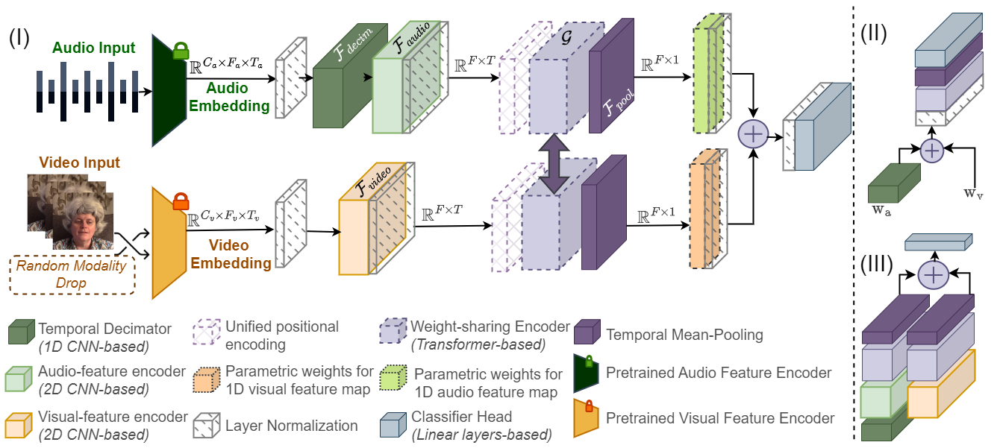

Certainly! Here's a revised and more professional version of the readme:

---

# Missingness-Resilient Video-Enhanced Multimodal Disfluency Detection

[](https://www.interspeech2024.org/)

<<<<<<< HEAD

=======

# Missingness-resilient Video-enhanced Multimodal Disfluency Detection

************* This page is under construction. We are working steadily to release the database and codebase at the earliest **********
>>>>>>> 9a0f2df01eafc13dfc9baac4492182c289a2456f

## Overview

Traditional methods for detecting speech disfluencies often rely solely on acoustic data. This paper introduces a novel multimodal approach that incorporates both audio and video modalities for more robust disfluency detection. We propose a unified weight-sharing encoder framework that handles temporal and semantic context fusion, designed to accommodate scenarios where video data may be missing during inference. Experimental results across five disfluency detection tasks demonstrate significant performance gains compared to unimodal methods, achieving an average absolute improvement of 10% when both modalities are consistently available, and 7% even when video data is missing in half of the samples.



## Dataset

We provide a time-aligned 3-second segmented audio-visual dataset, preprocessed and available for download [here](https://figshare.com/articles/dataset/Audio_Visual_Database_for_Speech_Disfluency/25526953). You can download the entire dataset using the following command:

```bash
wget https://figshare.com/ndownloader/articles/25526953/versions/1
```

## Codebase

### Dependencies

To set up the necessary dependencies, create a Conda environment using the provided `environment.yml` file:

```bash
conda env create -f environment.yml
```

### Training

#### Data Splits

All training data splits are located in the `./metadata` folder. Results reported are based on training with three different seeds (123, 456, 789).

To view available arguments for training:

```bash
python main_audio_video_unified_fusion.py -h
```

Example command for training with specific parameters:

```bash
python main_audio_video_unified_fusion.py --stutter_type='Block/' --num_epochs=400 --p_mask=0.5 --seed_num=456
```

<!-- ### Evaluation -->

<!-- Include evaluation details if applicable -->

## Citation

<!-- Include citation information if applicable -->

## Acknowledgement

We acknowledge [Lea et al.](https://machinelearning.apple.com/research/stuttering-event-detection) for their contributions in releasing the manually annotated audio dataset FluencyBank and the SEP28k dataset and [Romana et. al](https://arxiv.org/pdf/2311.00867) for their support in extending their work as a baseline in our analyses of multimodal disfluency detection.
 